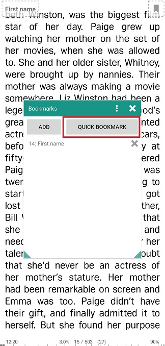

# Utilisation des signets en mode étendu (Ruban Signets)

> Vous pouvez faire en sorte que **Librera** affiche vos favoris à tout moment lors de la lecture d'un livre. Ils seront affichés en haut de l’écran dans un soi-disant _Bookmarks Ribbon_. Ce mode de signet étendu devrait être pratique lorsque vous devez ajouter de nouveaux signets ou basculer entre eux en un instant.
> Nous nous attendons à ce que cette fonctionnalité intéressante soit très demandée par les musiciens, tout en exécutant l'application en mode _Musician's_. Ainsi, le ruban est activé dans ce mode par défaut.

Pour l'activer dans les autres modes:

* Appuyez sur l'icône _Paramètres_ pour ouvrir la fenêtre **Préférences**.
* Appuyez sur l'onglet &quot;Barre d'état&quot;.
* Dans le panneau _Bookmarks Ribbon_, cochez la case en regard du mode pour lequel vous souhaitez activer le ruban.

||||
|-|-|-|
||||

Les opérations avec le ruban _Bookmarks_ sont illustrées en mode _Book_. Tout fonctionne de la même manière pour les trois modes.

> Si vous n'avez plus besoin du _Bookmark Ribbon_, vous pouvez le désactiver en décochant la case correspondante dans l'onglet _Barre d'état_.

||||
|-|-|-|
||||

**Ajout de signets**

> Le flotteur de signet dans le coin supérieur droit indique que vous êtes actuellement en mode _Bookmarks Ribbon_.

* Appuyez sur le flotteur de signet sur la page que vous souhaitez marquer.
* Appuyez sur _ADD_ pour ajouter le signet via la fenêtre _Bookmarks_.
* Faites un commentaire sur le favori. Notez que le nom du favori provient de votre commentaire (**premier favori** dans notre exemple).
* Appuyez sur **AJOUTER** pour terminer la procédure.

||||
|-|-|-|
||||

Votre nouveau signet apparaîtra dans la fenêtre _Bookmarks_ et en même temps, vous le verrez dans le ruban _Bookmarks_ en haut. Maintenant, pour revenir à ce signet, il vous suffit de cliquer dessus dans le ruban.

> Remarque: un appui long sur un signet dans le ruban ouvre une fenêtre d'édition.
* Enregistrez vos résultats de modification en appuyant sur **ENREGISTRER**.
* Vous pouvez également supprimer le favori en appuyant sur **SUPPRIMER**.
Le ruban deviendra un ruban à part entière sur votre écran lorsque vous avez de nombreux signets. Vous pouvez les parcourir en glissant votre doigt.

||||
|-|-|-|
||||

**Ajout de signets rapides**

* Appuyez sur le flotteur de signets dans le coin supérieur droit pour ouvrir la fenêtre _Bookmarks_.
* Appuyez sur **SIGNET RAPIDE**
* Ainsi, un &quot;signet rapide&quot; est créé, indiqué par le numéro de la page dans le ruban situé en haut. Dans la liste de la fenêtre _Bookmarks_, la page # et le signet rapide _ apparaîtront à côté.
> Vous pouvez appuyer longuement sur un favori dans la liste pour permettre sa modification ou sa suppression dans une fenêtre contextuelle de modification du favori.

||||
|-|-|-|
||||

> Vous pouvez ignorer certaines opérations lors de l'ajout ou de la suppression de signets à l'aide du ruban _Bookmarks_:

* Un appui long sur le flotteur de signets dans le coin supérieur droit ajoutera un signet rapide.
* Un appui long sur un signet dans le _Bookmarks Ribbon_ ouvrira une invite vous proposant de le supprimer.
