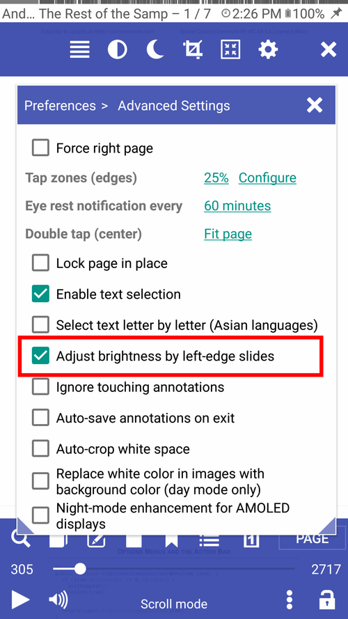

# Contrôle de la luminosité et filtre Bluelight

> Le contrôle de la luminosité dans **Librera Reader** peut être automatique, en fonction des paramètres de votre système, ou l'utilisateur peut régler la luminosité manuellement.
La luminosité peut être modifiée dans la fenêtre **Préférences** ou en faisant glisser un doigt le long du bord gauche de l'écran (cochez la case correspondante pour activer ce mode).
Une luminosité négative indique que votre réglage est plus sombre que celui du système.
La luminosité négative active le filtre bleu et la couleur noire par défaut.

* Définissez la luminosité pour qu'elle change automatiquement en fonction de la lumière ambiante (paramètres système).
* Modifiez la luminosité en faisant glisser votre doigt le long du bord gauche de l'écran.
* Tapez sur le toast Brightness pour passer en mode **Auto**.
* Activer/Désactiver les diapositives du bord gauche dans l'onglet &quot;Paramètres avancés&quot;

||||
|-|-|-|
||||

**Filtre Bluelight**
> Le filtre Bluelight dépend de votre réglage de luminosité. Il s’active automatiquement lorsque le réglage de luminosité a une valeur négative.

* Le filtre Bluelight peut être activé manuellement en cochant la case correspondante dans la fenêtre **Préférences**.
* Le filtre Bluelight est activé.
* Appuyez sur _Bluelight Filter_ pour définir votre teinte préférée (couleur).

||||
|-|-|-|
||||
