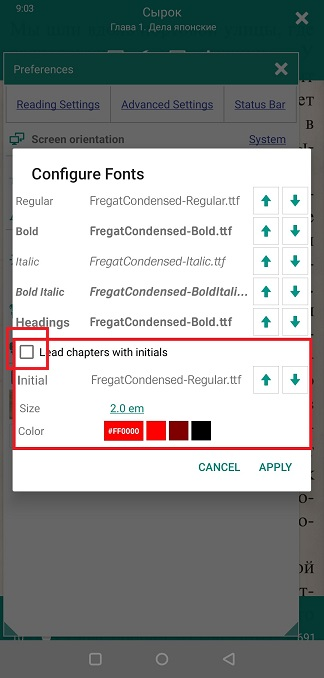

# تكوين الخطوط والأنماط

> **Librera** يسمح لك بتخصيص شكل وأسلوب المستند الذي تقرأه - اختيار الخطوط التي تروق لك وضبط حجمها ، وضبط أنماط CSS ، وتغيير الحروف الأولى إلى الأحرف الأولى (FB2).

ستنفذ كل ما سبق في علامة التبويب الرئيسية في نافذة **التفضيل** ، ومن الواضح في علامة التبويب _Reading Settings_.

> اضغط على أيقونة **الإعدادات** لفتح نافذة **التفضيلات**.

||||
|-|-|-|
||||

## تعديلات الخط

* حدد الخط الرئيسي من خلال النقر على الرابط _Font_ وتشغيله من خلال القائمة المنسدلة للخطوط المتوفرة.

> يمكنك إضافة الخطوط المفضلة لديك إلى القائمة:
1. قم بإنشاء مجلد باسم _Fonts_ في وحدة التخزين الداخلية لجهازك.
> ملاحظة: يوجد مجلد _Fonts_ آخر في وحدة التخزين الداخلية التي أنشأتها بالفعل **Librera** تلقائيًا.
2. احفظ الخطوط المفضلة لديك في مجلد _Fonts_ الخاص بك (أو مجلد _Fonts_ الخاص بـ **Librera**).
> (يمكنك أيضًا تنزيل بعض الخطوط الرائعة من موقعنا. راجع قسم **إعدادات القراءة** للحصول على إرشادات.)
> تذكر أنه سيتم تكريم الخطوط الخاصة بك فقط إذا كانت _Styles_ التي حددتها في علامة التبويب **إعدادات القراءة** تحتوي على _User-defined فيها.

لإعداد خطوط خاصة بالمستخدم لأنماط خطوط مختلفة ، انقر فوق الرمز المجاور للارتباط _Fonts_ لفتح نافذة _Configure Fonts_.

* اضغط على الإعداد لكل نمط واختر خطًا له.
* استخدم أزرار **لأعلى** و **لأسفل** للانتقال إلى خط تالٍ في القائمة (أحيانًا يكون هذا كافيًا لغرضك).
* لا تنس النقر على **تطبيق** بمجرد الانتهاء.

||||
|-|-|-|
||||

||||
|-|-|-|
||||

## الأحرف الأولى الرائدة في كتب FB2

يمكنك أن تجعل كل فصل من فصول كتابك يبدأ بأحرف أولية لطيفة المظهر.
 
> لن يظهر هذا الإعداد أثناء القراءة بأي تنسيق آخر.

* اضغط على الأيقونة بجانب رابط _Fonts_ لفتح نافذة _Configure Fonts_
* تحقق من فصول _Lead مع مربع اختيار الحروف الأولى (الحروف الأولى) لتمكين الحروف الأولى
* اضغط على رابط خط الوجه لتحديد خط لخطتك الأولى من قائمة منسدلة
* الآن اختر الحجم واللون الخاص بك الأولي عن طريق النقر على الروابط ذات الصلة
* اضغط **قدم** لحفظ الإعدادات

||||
|-|-|-|
||||

## **إعدادات القراءة** علامة تبويب

> هذه هي إعدادات _Userefined. إنها تتجاوز إعدادات النمط المشفرة بشكل أساسي في ملف .css الخاص بكتابك. تحتاج إلى اختيار أنماط _User-defined_ لجعلها تعمل.

* حدد محاذاة النص المفضل لديك من القائمة المنسدلة.
* استخدم منزلقات أو **-** و **+** الصنابير لضبط تباعد الأسطر والفقرات ، المسافات البادئة للنص وهوامش الصفحة.
* بواسطة _normalizing font-size_ ، تجعل كل الخطوط في الوثيقة متساوية (1em ، عادية).
* يمكنك أيضًا تحديد لون الروابط في وثيقتك لكل وضع (ليلا ونهارا).

||||
|-|-|-|
||||

**اختر _Styles_ لكتابك بحكمة**

* _Document_ ، سيتم استخدام إعدادات .css للكتاب
* _User-defined_ ، سيتم استخدام إعدادات علامة التبويب هذه
* _Document + User-defined_ (افتراضي ، مستحسن) ، محاولتنا لدمج إعدادات المستخدم في إعدادات .css للكتاب (أو حوله). يعمل معظم الوقت!

## نافذة كود CSS المخصصة ****

تفتح هذه النافذة عند النقر على الأيقونة بجانب _Styles_

يمكن للأشخاص المألوفين بترميز CSS إجراء بعض التخصيص المخصص على طريقة عرض كتابك. (انظر المزيد تحت الأسئلة الشائعة **تخصيص أنماط كتاب CSS**).

> لا تنس إزالة الشفرة بمجرد انتهائك من الكتاب! قد لا تعمل في المرحلة التالية.

||||
|-|-|-|
||||

||||
|-|-|-|
||||
