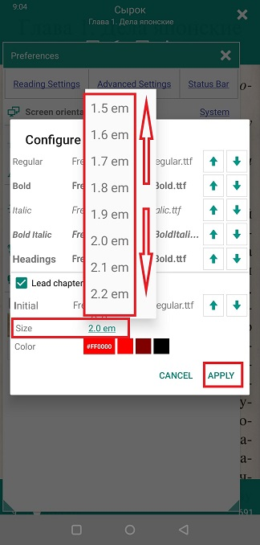
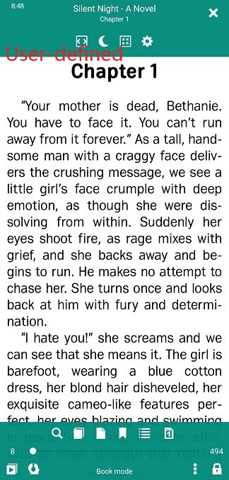

# Configuración de fuentes y estilos

> **Librera** le permite personalizar la apariencia del documento que está leyendo: elija las fuentes a su gusto y ajuste su tamaño, ajuste los estilos CSS y cambie las primeras letras a iniciales iniciales (FB2).

Hará todo lo anterior en la pestaña principal de la ventana **Preferencia** y, obviamente, en la pestaña _Configuración de lectura_.

> Toque el icono **Configuración** para abrir la ventana **Preferencias**.

||||
|-|-|-|
||||

## Ajustes de fuente

* Seleccione su fuente principal tocando el enlace _Font_ y recorriendo la lista desplegable de fuentes disponibles.

> Puede agregar sus fuentes favoritas a la lista:
1. Cree una carpeta llamada _Fonts_ en el almacenamiento interno de su dispositivo.
> Nota: Hay otra carpeta _Fonts_ en su almacenamiento interno ya creada por **Librera** automáticamente.
2. Guarde sus fuentes favoritas en su carpeta _Fonts_ (o en la carpeta _Fonts_ propia de **Librera**).
> (También puede descargar algunas fuentes agradables de nuestro sitio. Consulte la sección **Configuración de lectura** para obtener instrucciones).
> Recuerde que sus fuentes se respetarán solo si los _Styles_ que ha seleccionado en la pestaña **Configuración de lectura** tienen _User-definido_ en ellos.

Para configurar fuentes específicas del usuario para diferentes estilos de fuente, toque el icono al lado del enlace _Fuentes_ para abrir la ventana _Configurar fuentes_.

* Toque la configuración para cada estilo y seleccione una fuente para él.
* Use los botones **arriba** y **abajo** para saltar a la siguiente fuente en la lista (a veces esto será suficiente para su propósito).
* No olvides tocar **APLICAR** una vez que hayas terminado.

||||
|-|-|-|
||||

||||
|-|-|-|
||||

## Principales iniciales en libros de FB2

Puede hacer que cada capítulo de su libro comience con una bonita inicial.
 
> Esta configuración no se mostrará mientras se lee en cualquier otro formato.

* Toque el icono junto al enlace _Fuentes_ para abrir la ventana _Configurar fuentes_
* Marque la casilla de verificación _Lead capítulos con iniciales_ para habilitar las iniciales
* Toque el enlace de fuente para seleccionar una fuente para su inicial de una lista desplegable
* Ahora elija el tamaño y el color para su inicial tocando los enlaces respectivos
* Toque **APLICAR** para guardar la configuración

||||
|-|-|-|
||||

## La pestaña **Configuración de lectura**

> Estas son configuraciones definidas por el usuario. Principalmente anulan la configuración de estilo codificada en el archivo .css de su libro. Debe elegir los estilos definidos por el usuario para que funcione.

* Seleccione su alineación de texto preferida de la lista desplegable.
* Use controles deslizantes o **-** y **+** toques para ajustar el espaciado entre líneas y párrafos, sangrías de texto y márgenes de página.
* Al normalizar el tamaño de fuente, todas las fuentes en el documento son iguales (1em, regular).
* También puede especificar el color de los enlaces en su documento para cada modo (día y noche).

||||
|-|-|-|
||||

**Elija _Styles_ para su libro sabiamente**

* _Documento_, se utilizará la configuración .css del libro
* _Definido por el usuario_, se usará la configuración de esta pestaña
* _Documento + Definido por el usuario_ (predeterminado, recomendado), nuestro intento de incorporar la configuración del usuario en la configuración del libro .css (o al revés). ¡Trabaja la mayor parte del tiempo!

## La ventana **Código CSS personalizado**

Esta ventana se abre al tocar el ícono junto a _Styles_

Quienes estén familiarizados con la codificación CSS pueden realizar algunas personalizaciones ad-hoc en la forma en que se muestra su libro. (Ver más en Preguntas frecuentes **Personalizar estilos CSS de libros**).

> ¡No olvides eliminar el código una vez que hayas terminado con el libro! Puede que no funcione en el próximo.

||||
|-|-|-|
||||

||||
|-|-|-|
||||
