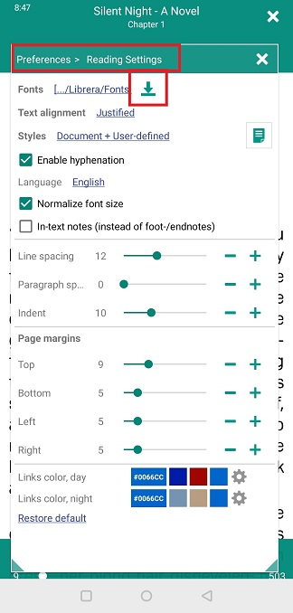
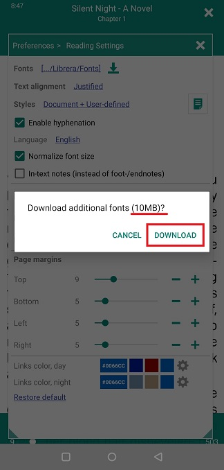

# Configuration des polices et des styles

> **Librera** vous permet de personnaliser l'apparence du document que vous lisez. Choisissez les polices à votre guise, ajustez leur taille, ajustez les styles CSS et modifiez les premières lettres en initiales (FB2).

Vous ferez tout ce qui précède dans l'onglet principal de la fenêtre **Préférences** et, bien entendu, dans l'onglet &quot;Paramètres de lecture&quot;.

> Appuyez sur l'icône **Paramètres** pour ouvrir la fenêtre **Préférences**.

||||
|-|-|-|
||||

## Ajustements de police

* Sélectionnez votre police principale en appuyant sur le lien _Font_ et en parcourant la liste déroulante des polices disponibles.

> Vous pouvez ajouter vos polices préférées à la liste:
1. Créez un dossier nommé _Fonts_ dans la mémoire de stockage interne de votre appareil.
> Remarque: il existe un autre dossier _Fonts_ dans votre stockage interne déjà créé par **Librera** automatiquement.
2. Enregistrez vos polices préférées dans votre dossier _Fonts_ (ou dans le propre dossier _Fonts_ de **Librera**).
> (Vous pouvez également télécharger de belles polices sur notre site. Consultez la section **Paramètres de lecture** pour obtenir des instructions.)
> N'oubliez pas que vos polices ne seront prises en compte que si les _Styles_ que vous avez sélectionnés dans l'onglet **Paramètres de lecture** contiennent _Utilisateur_ défini_.

Pour configurer des polices spécifiques à l'utilisateur pour différents styles de police, appuyez sur l'icône en regard du lien _Fonts_ pour ouvrir la fenêtre _Configure Fonts_.

* Tapez sur le réglage de chaque style et sélectionnez une police pour ce style.
* Utilisez les boutons **vers le haut** et **vers** pour passer à la police suivante de la liste (cela suffira parfois à votre objectif).
* N'oubliez pas d'appuyer sur **APPLIQUER** une fois que vous avez terminé.

||||
|-|-|-|
||||

||||
|-|-|-|
||||

## Initiales principales dans les livres FB2

Vous pouvez faire commencer chaque chapitre de votre livre avec une belle initiale.
 
> Ce paramètre ne sera pas affiché lors de la lecture dans un autre format.

* Appuyez sur l'icône en regard du lien _Fonts_ pour ouvrir la fenêtre _Configurer les polices_
* Cochez les chapitres _Lead avec les initiales_ pour activer les initiales
* Appuyez sur le lien font-face pour sélectionner une police pour votre initiale dans une liste déroulante.
* Choisissez maintenant la taille et la couleur de votre initiale en appuyant sur les liens correspondants.
* Appuyez sur **APPLIQUER** pour enregistrer les paramètres.

||||
|-|-|-|
||||

## L'onglet **Paramètres de lecture**

> Ce sont les paramètres définis par l'utilisateur. Ils remplacent principalement les paramètres de style encodés dans le fichier .css de votre livre. Vous devez choisir les styles définis par l'utilisateur pour que cela fonctionne.

* Sélectionnez votre alignement de texte préféré dans la liste déroulante.
* Utilisez les curseurs ou les touches **-** et **+** pour régler l'espacement des lignes et des paragraphes, les retraits de texte et les marges de la page.
* En normalisant font-size_, vous rendez toutes les polices du document égales (1em, normales).
* Vous pouvez également spécifier la couleur des liens dans votre document pour chaque mode (jour et nuit).

||||
|-|-|-|
||||

**Choisissez judicieusement _Styles_ pour votre livre**

* _Document_, les paramètres .css du livre seront utilisés
* _Utilisateur_ défini_, les paramètres de cet onglet seront utilisés
* _Document + User-defined_ (par défaut, recommandé), notre tentative d'incorporer les paramètres utilisateur dans les paramètres .css du livre (ou le chemin alternatif). Fonctionne la plupart du temps!

## La fenêtre **Code CSS personnalisé**

Cette fenêtre s'ouvre lorsque vous appuyez sur l'icône située à côté de _Styles_

Les personnes familiarisées avec le codage CSS peuvent procéder à une personnalisation ad-hoc de la manière dont votre livre est affiché. (Plus d’informations sous FAQ **Personnaliser les styles CSS du livre**).

> N'oubliez pas de supprimer le code une fois que vous avez terminé avec le livre! Cela pourrait ne pas fonctionner dans le prochain.

||||
|-|-|-|
||||

||||
|-|-|-|
||||
