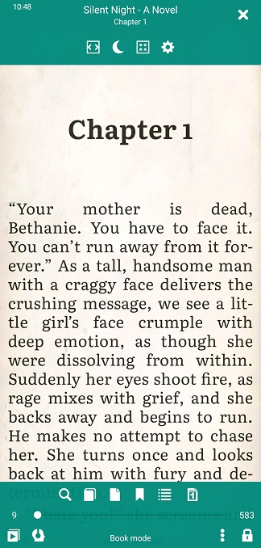

# Configuring Fonts and Styles

> **Librera** allows you to customize the look and feel of the document you're reading—choose the fonts to your liking and adjust their size, adjust CSS styles, and change first letters into leading initials (FB2).

You will do all of the above  in the main tab of the **Preference** window and, obviously, in the _Reading Settings_ tab.

> Tap the **Settings** icon to open the **Preferences** window.

||||
|-|-|-|
||||

## Font Adjustments

* Select your main font by tapping on the _Font_ link and running through the dropdown list of available fonts.

> You can add your favorite fonts to the list:
1. Create a folder named _Fonts_ in your device's internal storage. 
> Note: There is another _Fonts_ folder in your internal storage already created by **Librera** automatically.
2. Save your favorite fonts to your _Fonts_ folder (or **Librera**'s own _Fonts_ folder).
> (You can also download some nice fonts from our site. See the **Reading Settings** section for instructions.)
> Remember that your fonts will be honored only if the _Styles_ you've selected in the **Reading Settings** tab have _User-defined_ in them.

To set up user-specific fonts for different font-styles, tap the icon next to the _Fonts_ link to open the _Configure Fonts_ window.

* Tap the setting for each style and select a font for it.
* Use **up** and **down** buttons to jump to a next font on the list (sometimes this will suffice for your purpose).
* Don't forget to tap **APPLY** once you're finished.

||||
|-|-|-|
||||

||||
|-|-|-|
||||

## Leading Initials in FB2 Books

You can make each and every chapter in your book start with a nice-looking initial.
 
> This setting won't show while reading in any other format.

* Tap the icon next to the _Fonts_ link to open the _Configure Fonts_ window
* Check the _Lead chapters with initials_ checkbox to enable initials 
* Tap on the font-face link to select a font for your initial from a dropdown list
* Now choose the size and color for your initial by tapping respective links
* Tap **APPLY** to save the settings

||||
|-|-|-|
||||

## The **Reading Settings** Tab

> These are _User-defined_ settings. They mainly override the style settings encoded in your book's .css file. You need to choose _User-defined_ styles to make it work.

* Select your preferred text alignment from the dropdown list.
* Use sliders or **-** and **+** taps to adjust line and paragraph spacing, text indents and page margins.
* By _normalizing font-size_ you make all fonts in the document equal (1em, regular).
* You can also specify the color of links in your document for each mode (day and night). 

||||
|-|-|-|
||||

**Choose _Styles_ for your book wisely**

* _Document_, book's .css settings will be used
* _User-defined_, this tab's settings will be used
* _Document + User-defined_ (default, recommended), our attempt at incorporating user settings into the book's .css settings (or the way around). Works most of the time!

## The **Custom CSS Code** Window

This window opens on tapping on the icon next to _Styles_

Those familiar with CSS coding can make some ad-hoc customization to the way your book is displayed. (See more under FAQ's **Customize Book CSS Styles**).

> Don't forget to remove the code once you're done with the book! It might not work in the next one.

||||
|-|-|-|
||||

||||
|-|-|-|
||||
