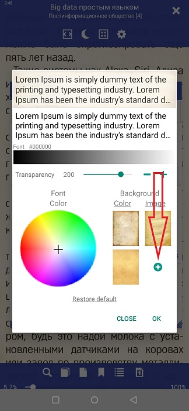

# Personalizar el fondo de la página

> **Librera** permite al usuario leer sus libros sobre un fondo personalizable. El usuario puede tener un fondo específico para cada perfil, configurable por separado para los modos de lectura diurna y nocturna. Los fondos pueden ser solo colores sólidos o el usuario puede agregarles texturas (o imágenes), ya sea desde los archivos de muestra de **Librera** o usando sus propias imágenes.

## Configurando tu propio fondo
* Toque el icono de configuración para abrir la ventana **Preferencias**
* Toque _Día_ para cambiar el fondo para el modo día (o _Noche_ para el modo nocturno)
* En el panel _Background_, podrá cambiar su color y textura de fondo (o simplemente puede colgar su propia imagen en el fondo)
* La transparencia de la imagen de fondo se puede cambiar arrastrando el control deslizante _Transparencia_

||||
|-|-|-|
||||

## Cambiar un fondo de color sólido
* Toque **Color** para abrir una paleta de colores con una cruz y arrastre la cruz alrededor de la paleta (siga los cambios en la vista previa de la página en tiempo real en la parte superior)
* Puede hacer que su fondo de color sólido sea más claro o más oscuro arrastrando el control deslizante a través de la banda de color
* No olvides tocar _OK_ para guardar los cambios una vez que hayas terminado

||||
|-|-|-|
||||

## Agregar textura o imagen al fondo
* Toque **Imagen** en el panel _Fondo_
* Puede usar cualquiera de los archivos de textura incorporados tocándolo
* Para agregar su propia imagen, toque **+** y navegue a la carpeta con la imagen que está a punto de agregar
* Encuentra tu imagen, tócala y luego toca _SELECCIONAR_
* Ajuste su transparencia utilizando la vista previa en tiempo real
* Toque _OK_ cuando haya terminado

||||
|-|-|-|
||||

> Siempre puede usar los ajustes preestablecidos de fondo y fuente que se muestran en la Fig. 2. Se pueden editar con bastante facilidad en la ventana **Configurar** (toque el icono de edición indicado por la flecha púrpura).
