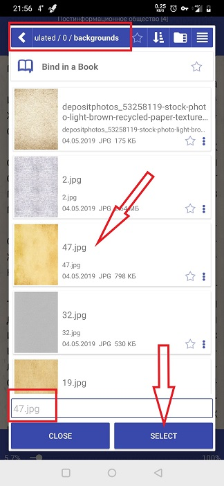

# Personnalisation de l'arrière-plan de la page

> **Librera** permet à l'utilisateur de lire ses livres sur un fond personnalisable. L'utilisateur peut avoir un arrière-plan spécifique pour chaque profil, configurable séparément pour les modes de lecture de jour et de nuit. Les arrière-plans peuvent être uniquement des couleurs unies ou l'utilisateur peut leur ajouter des textures (ou des images), à partir des fichiers d'exemple de **Librera** ou en utilisant leurs propres images.

## Configuration de votre propre arrière-plan
* Appuyez sur l'icône des paramètres pour ouvrir la fenêtre **Préférences**.
* Appuyez sur _Jour_ pour modifier l'arrière-plan du mode jour (ou _Nuit_ pour le mode nuit)
* Dans le panneau _Background_, vous pourrez modifier la couleur et la texture de votre arrière-plan (ou vous pouvez simplement accrocher votre propre image en arrière-plan)
* La transparence de votre image d'arrière-plan peut être modifiée en faisant glisser le curseur _Transparency_

||||
|-|-|-|
||||

## Modification d'un arrière-plan uni
* Appuyez sur **Couleur** pour ouvrir une palette de couleurs avec une croix et faites glisser la croix autour de la palette (suivez les modifications dans l'aperçu de la page en temps réel en haut)
* Vous pouvez éclaircir ou assombrir votre arrière-plan uni en faisant glisser le curseur sur la bande de couleur
* N'oubliez pas d'appuyer sur _OK_ pour enregistrer les modifications une fois que vous avez terminé

||||
|-|-|-|
||||

## Ajout d'une texture ou d'une image à l'arrière-plan
* Appuyez sur **Image** dans le panneau _Background_
* Vous pouvez utiliser n'importe quel fichier de texture intégré en appuyant dessus
* Pour ajouter votre propre image, appuyez sur **+** et accédez au dossier contenant l'image que vous êtes sur le point d'ajouter
* Trouvez votre image, appuyez dessus, puis appuyez sur _SELECT_
* Ajustez sa transparence à l'aide de l'aperçu en temps réel
* Appuyez sur _OK_ lorsque vous avez terminé

||||
|-|-|-|
||||

> Vous pouvez toujours utiliser les préréglages d'arrière-plan et de police illustrés à la Fig. 2. Ils peuvent être modifiés assez facilement dans la fenêtre **Configurer** (appuyez sur l'icône d'édition indiquée par la flèche violette).
