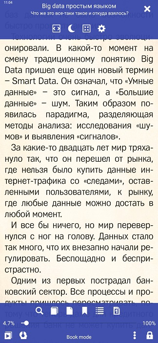

# Customizing Page Background

> **Librera** allows the user to read their books against a customizable background. The user can have a specific background for each profile, configurable separately for day and night reading modes. Backgrounds can be just solid colors or the user can add textures (or pictures) to them, either from **Librera**'s sample files or using their own images.

## Setting Up Your Own Background
* Tap the settings icon to open the **Preferences** window
* Tap _Day_ for changing the background for day mode (or _Night_ for night mode)
* In the _Background_ panel, you will be able to change your backgound color and texture (or you can just hang up your own picture in the background)
* Your background picture's transparency can be changed by dragging the _Transparency_ slider

||||
|-|-|-|
||||

## Changing a Solid-Color Background
* Tap **Color** to open a color palette with a cross and drag the cross around the palette (follow changes in the real-time page preview at the top)
* You can make your solid-color background lighter or darker by dragging the slider across the color band
* Don't forget to tap _OK_ to save changes once you're done

||||
|-|-|-|
||||

## Adding Texture or Picture to the Background
* Tap **Image** in the _Background_ panel
* You can use any of the inbuilt texture files by tapping on it 
* To add your own image, tap **+** and navigate to the folder with the image you're about to add
* Find your image, tap on it and then tap _SELECT_
* Adjust its transparency using the real-time preview
* Tap _OK_ when you're finished

||||
|-|-|-|
||||

> You can always use the background and font presets shown in Fig. 2. They can be edited pretty easily in the **Configure** window (tap on the edit icon indicated by the purple arrow).
