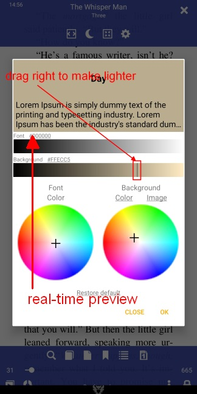

# Personalizzazione dello sfondo della pagina

> **Librera** consente all'utente di leggere i propri libri su uno sfondo personalizzabile. L'utente può avere uno sfondo specifico per ciascun profilo, configurabile separatamente per le modalità di lettura diurna e notturna. Gli sfondi possono essere solo a tinta unita o l'utente può aggiungere trame (o immagini) ad essi, dai file di esempio di **Librera** o usando le proprie immagini.

## Impostazione del proprio background
* Tocca l'icona delle impostazioni per aprire la finestra **Preferenze**
* Tocca _Day_ per cambiare lo sfondo per la modalità giorno (o _Night_ per la modalità notte)
* Nel pannello _Background_, sarai in grado di cambiare il colore e la trama del backgound (oppure puoi semplicemente appendere la tua foto in background)
* La trasparenza dell'immagine di sfondo può essere modificata trascinando il cursore _Trasparenza_

||||
|-|-|-|
||||

## Modifica di uno sfondo a tinta unita
* Tocca **Colore** per aprire una tavolozza di colori con una croce e trascina la croce intorno alla tavolozza (segui le modifiche nell'anteprima della pagina in tempo reale in alto)
* Puoi rendere il tuo sfondo a tinta unita più chiaro o più scuro trascinando il cursore sulla fascia di colore
* Non dimenticare di toccare _OK_ per salvare le modifiche al termine

||||
|-|-|-|
||||

## Aggiunta di trama o immagine allo sfondo
* Tocca **Immagine** nel pannello _Background_
* È possibile utilizzare qualsiasi file di trama incorporato toccandolo
* Per aggiungere la tua immagine, tocca **+** e vai alla cartella con l'immagine che stai per aggiungere
* Trova la tua immagine, toccala e quindi tocca _SELEZIONA_
* Regola la sua trasparenza usando l'anteprima in tempo reale
* Al termine, tocca _OK_

||||
|-|-|-|
||||

> Puoi sempre usare i predefiniti di sfondo e dei caratteri mostrati in Fig. 2. Possono essere modificati abbastanza facilmente nella finestra **Configura** (tocca l'icona di modifica indicata dalla freccia viola).
