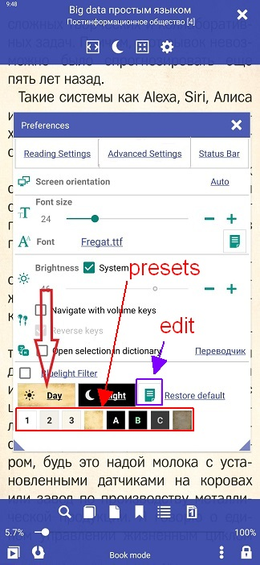

# Personalizando o plano de fundo da página

> **Librera** permite que o usuário leia seus livros em um fundo personalizável. O usuário pode ter um plano de fundo específico para cada perfil, configurável separadamente para os modos de leitura diurno e noturno. Os fundos podem ser apenas cores sólidas ou o usuário pode adicionar texturas (ou figuras) a eles, a partir dos arquivos de amostra de **Librera** ou usando suas próprias imagens.

## Configurando seu próprio histórico
* Toque no ícone de configurações para abrir a janela **Preferências**
* Toque em _Dia_ para alterar o plano de fundo para o modo diurno (ou _Noite_ para o modo noturno)
* No painel _Background_, você poderá alterar a cor e a textura do fundo (ou simplesmente pendurar sua própria imagem em segundo plano)
* A transparência da sua imagem de plano de fundo pode ser alterada arrastando o controle deslizante _Transparency_

||||
|-|-|-|
||||

## Alterando um fundo de cor sólida
* Toque em **Cor** para abrir uma paleta de cores com uma cruz e arraste a cruz ao redor da paleta (siga as alterações na visualização da página em tempo real na parte superior)
* Você pode tornar seu fundo de cor sólida mais claro ou mais escuro arrastando o controle deslizante pela faixa de cores
* Não se esqueça de tocar em _OK_ para salvar as alterações assim que terminar

||||
|-|-|-|
||||

## Adicionando textura ou imagem ao fundo
* Toque em **Imagem** no painel _Background_
* Você pode usar qualquer um dos arquivos de textura embutidos tocando nele
* Para adicionar sua própria imagem, toque em **+** e navegue até a pasta com a imagem que você está prestes a adicionar
* Encontre sua imagem, toque nela e depois em _SELECT_
* Ajuste sua transparência usando a visualização em tempo real
* Toque em _OK_ quando terminar

||||
|-|-|-|
||||

> Você sempre pode usar as predefinições de fundo e fonte mostradas na Fig. 2. Elas podem ser editadas facilmente na janela **Configurar** (toque no ícone de edição indicado pela seta roxa).
