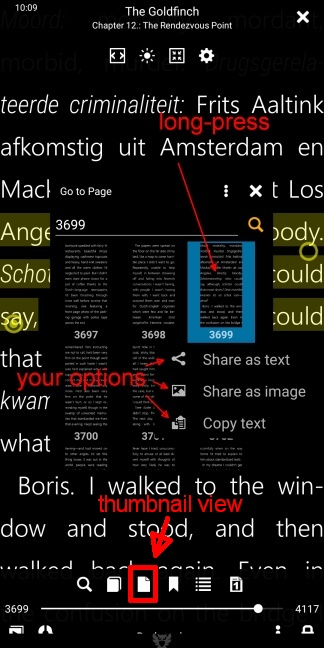

# Comment sélectionner du texte dans Librera

> Les options de sélection de texte de **Librera** sont assez sophistiquées. Avec un appui long (et en faisant glisser), vous pouvez sélectionner des mots, des passages et des pages entières. Ensuite, vous pouvez facilement, en un clic, copier du texte pour le coller dans une autre application, partager votre sélection avec d'autres utilisateurs, créer un signet, l'envoyer à un moteur TTS (pour le lire à voix haute) ou pour l'activer/désactiver. traducteurs/dictionnaires en ligne, etc.

Pour activer la sélection de texte:
* Appuyez sur au centre de l'écran pour ouvrir le menu.
* Appuyez sur l'icône des paramètres pour ouvrir la fenêtre **Préférences**.
* Accédez à l'onglet &quot;Paramètres avancés&quot; et cochez la case correspondante.

||||
|-|-|-|
||||

## Options de sélection de texte
* Les utilisateurs impatients peuvent cocher la case &quot;Une seule fois pour sélectionner&quot;. (Cette option fonctionne très bien avec l'option _Open selection in dictionary_ de l'onglet_ de l'onglet principal de la fenêtre **Préférences**.)
* L'option _Sélectionner lettre par lettre_ devrait être utile lors de la sélection de texte dans certaines langues asiatiques.

## Sélection de segments de texte et de pages entières
* Appuyez longuement sur un mot du passage que vous souhaitez sélectionner.
* Faites glisser votre doigt dans le sens de la sélection. Lorsque vous voyez les poignées de début et de fin, vous pouvez relâcher votre doigt, fermer la fenêtre _Text_ et continuer à sélectionner du texte en faisant glisser les poignées.
* Pour sélectionner une page entière, ouvrez la fenêtre _Go to Page_ en appuyant sur l'icône Vue miniature
* Appuyez longuement sur la page que vous souhaitez sélectionner et choisissez une option dans la liste déroulante.

||||
|-|-|-|
||||
