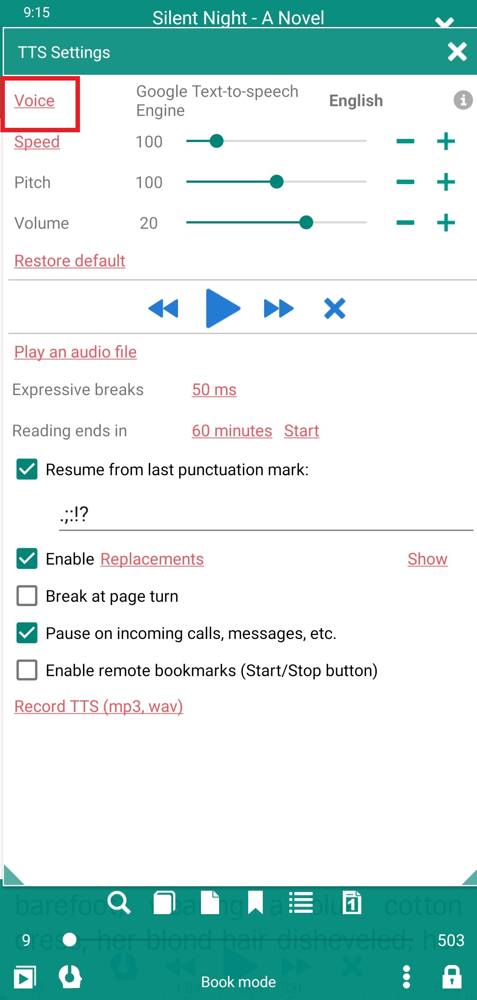
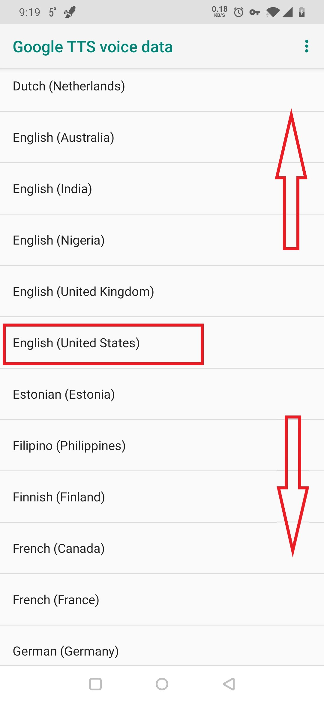

# Utilizzo di un motore di sintesi vocale con _Librera_

> **Librera** può leggere ad alta voce i tuoi libri (e altri documenti) utilizzando un motore di sintesi vocale (TTS) di terze parti installato sul tuo sistema Android. Supporta ad alta voce per un gran numero di formati di ebook, da EPUB a Kindle a PDF.

# Scelta di un motore TTS

* Tocca l'icona TTS nella parte inferiore dello schermo per aprire la finestra **Impostazioni TTS**
* Tocca **&quot;i&quot;** per aprire un elenco a discesa di motori TTS
* Seleziona il motore che preferisci. Se il motore che hai scelto non è ancora installato sul tuo sistema, verrai reindirizzato al Google Play Store. Segui le istruzioni del tuo motore preferito per configurarlo, scaricare le voci principali e aggiuntive, ecc.

> Nota: gli sviluppatori del motore potrebbero addebitare costi aggiuntivi, ad esempio voci aggiuntive.

||||
|-|-|-|
||||

## Esempio: configurazione del motore di sintesi vocale di Google

* Nella finestra **Impostazioni TTS** di **Librera**, segui il link _Voice_ alla pagina delle impostazioni **di sintesi vocale** del tuo sistema
* Tocca l'icona delle impostazioni accanto a _Preferred engine_
* Tocca _Installa dati vocali_ per selezionare la lingua e la voce TTS
* Prova la voce che hai selezionato toccando _PLAY_ nella pagina **Sintesi vocale**

> È possibile ottimizzare le impostazioni del motore (ad es. Velocità di lettura, tonalità e/o volume) nella finestra **Impostazioni TTS** di Librera**.

||||
|-|-|-|
||||

||||
|-|-|-|
||||

> Nota: la configurazione vocale in altri motori TTS viene eseguita in modo simile. Ricorda che i file di dati vocali potrebbero essere piuttosto grandi. Per risparmiare i tuoi piani dati cellulari limitati, assicurati che vengano scaricati solo tramite connessione WiFi.
