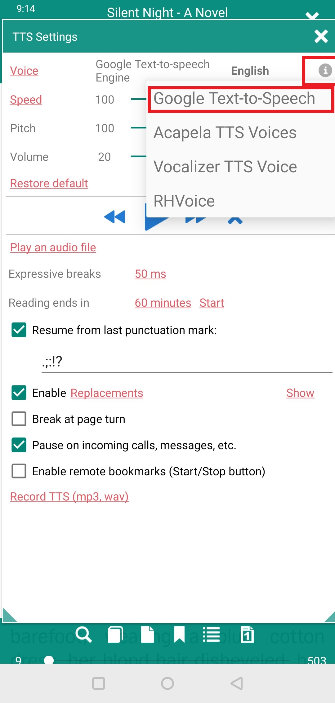

# Использование механизма преобразования текста в речь с _Librera_

> **Librera** может читать ваши книги (и другие документы) вслух, используя сторонний механизм преобразования текста в речь (TTS), установленный в вашей системе Android. Он поддерживает чтение вслух для большого количества форматов электронных книг, от EPUB до Kindle и PDF.

# Выбор двигателя TTS

* Нажмите на значок TTS в нижней части экрана, чтобы открыть окно **Настройки TTS**
* Нажмите **«i»**, чтобы открыть раскрывающийся список двигателей TTS.
* Выберите любой двигатель, который вам нравится. Если выбранный вами движок еще не установлен в вашей системе, вы будете перенаправлены в Google Play Store. Следуйте инструкциям для предпочитаемого вами движка, чтобы настроить его, загрузить основной и дополнительный голоса и т. Д.

> Примечание. С вас могут взимать плату за дополнительные функции, например за дополнительные голоса, разработчики движка.

||||
|-|-|-|
||||

## Пример: настройка Google Text-to-Speech Engine

* В окне ****настроек TTS** Librera** перейдите по ссылке _Voice_ на страницу **настроек преобразования текста в речь вашей системы**.
* Нажмите значок настроек рядом с _Preferred engine_
* Нажмите _Установить голосовые данные_, чтобы выбрать язык и голос TTS.
* Проверьте выбранный вами голос, нажав _PLAY_ назад на **странице преобразования текста в речь**

> Вы можете точно настроить параметры двигателя (например, скорость чтения, высоту и/или громкость) в окне ****Настройки TTS** Librera.

||||
|-|-|-|
||||

||||
|-|-|-|
||||

> Примечание. Настройка голоса в других движках TTS выполняется аналогичным образом. Помните, что файлы голосовых данных могут быть довольно большими. Чтобы сэкономить свои ограниченные тарифные планы на передачу данных, убедитесь, что они загружаются только через соединение WiFi.
