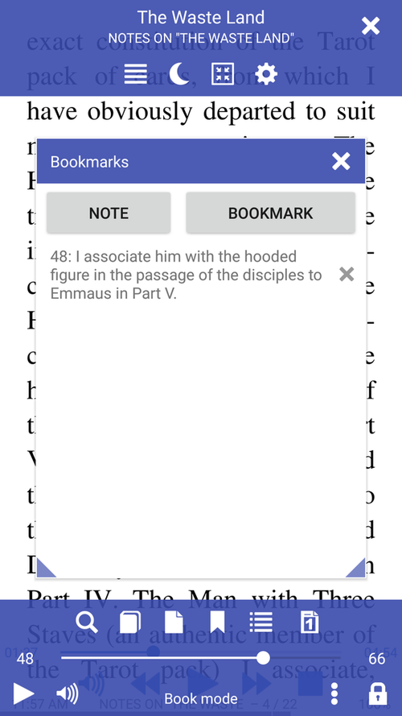

# **Librera** для изучения иностранных языков

> **Librera** - отличный инструмент для тех, кто изучает иностранный язык ... или просто читает книгу на другом языке.

Просто используйте свой палец (любой палец), чтобы выделить/выделить текст
* легко и быстро перевести выбранное слово, отрывок или даже страницу
* Настройте **Librera** для работы с онлайн и оффлайн переводчиками и/или словарями

||||
|-|-|-|
||||

* Включить поиск по словарю в одно касание (длительное нажатие) (установите флажок)
* Это также относится к отрывочным переводам, если ваш «словарь выбора», скажем, Google Translate (убедитесь, что ваше интернет-соединение установлено и работает)
> Обратите внимание! Вы можете настроить **Librera** для выбора слов одним нажатием на вкладке _Advanced Settings_ (не рекомендуется)

||||
|-|-|-|
||||

Если опция _Open в Dictionary_ не отмечена, вы увидите несколько вариантов в окне _Text_:
* Заставьте **Либреру** произнести вам слово или прочитайте вслух ваш выбор
* Сделать так, чтобы он прочитал всю книгу вслух (голосовое сопровождение)
* Открыть слово/отрывок в другом словаре/переводчике
* Закладка страниц со значимыми последовательностями слов

||||
|-|-|-|
||||

> Вы можете воспроизводить внешние аудиофайлы с помощью **Librera**. Он поддерживает все часто используемые аудиоформаты, например .mp3, .mp4, .wav, .ogg, .m4a и .flac.
* Воспроизведение аудиокниг вместе с их электронными копиями (голосовое сопровождение)
* Управляйте скоростью чтения с помощью органов управления воспроизведением внизу
* Используйте окно **закладок** для навигации по книге

||||
|-|-|-|
||||

> **Длительное нажатие на кнопку «Воспроизведение/Пауза» перемотает трек в самое начало.**
