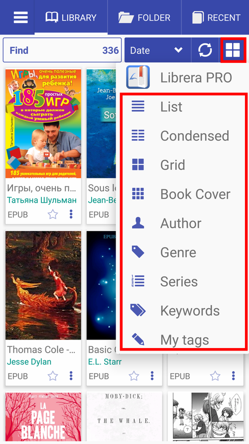

# التنقل في _Library_ Tab

> بمجرد التثبيت ، سيتم فتح **Librera** افتراضيًا بعلامة تبويب _Library_ الخاصة بها ، وتزخر بمعلومات مفيدة حول الكتب (والمستندات الأخرى) الموجودة على جهازك. فيما يلي دليل سريع حول علامة التبويب _Library_.

* علامة التبويب _Library_ ، العرض الافتراضي
* فرز الكتب على أرفف مكتبتك وفقًا لمعايير معينة (حسب اسم الملف أو المؤلف أو التاريخ أو ما إلى ذلك)
* يمكنك تغيير طريقة عرض كتبك على الأرفف عن طريق تغيير تخطيط المكتبة (القائمة ، الشبكة ، أغلفة الكتب ، إلخ.)

||||
|-|-|-|
||||

* عرض مكثف (عمودين)
* عرض الشبكة
* أغلفة الكتب فقط

||||
|-|-|-|
||||

* ابحث عن كتب في مكتبتك
* اضغط على أيقونة النجمة لإضافة كتاب إلى **المفضلة**
* اضغط على أيقونة النقطة الثلاثية لفتح قائمة الكتاب
* سيطالبك الضغط لفترة طويلة على أيقونة النجمة بإضافة علامة مخصصة
* انقر فوق # التاريخ لإضافة علامة مخصصة إلى كتاب
* الضغط لفترة طويلة على غلاف الكتاب لفتح نافذة **Book Info**

||||
|-|-|-|
||||

* ابحث عن كتاب بالامتداد (FB2 ، في مثالنا أدناه)
* اضغط على اسم المؤلف للعثور على جميع الكتب التي كتبها هذا المؤلف في المكتبة
* اضغط _x_ لمسح نتائج البحث
* الضغط لفترة طويلة على علامة التجزئة لعرض وتعديل سجل البحث وقائمة الإكمال التلقائي
* عرض **معلومات الكتاب** وتحقق من مدى وجودك في هذا الكتاب (نصيحة: يمكنك إعادة ضبط تقدم القراءة عن طريق قائمة الكتب)

||||
|-|-|-|
||||
