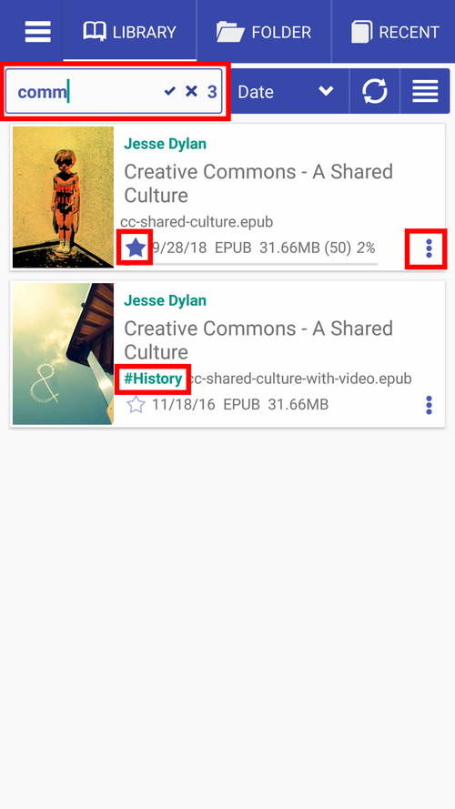

# Навигация по вкладке _Library_

> После установки **Librera** по умолчанию откроется на вкладке _Library_, где вы найдете полезную информацию о книгах (и других документах), найденных на вашем устройстве. Вот краткое руководство по вкладке _Library_.

* вкладка _Library_, вид по умолчанию
* Сортировка книг на полках вашей библиотеки по определенным критериям (по имени, автору, дате и т. Д.)
* Вы можете изменить способ отображения своих книг на полках, изменив макет библиотеки (список, сетка, обложки книг и т. Д.)

||||
|-|-|-|
||||

* сжатый (двухколонный) вид
* вид сетки
* Только обложки для книг

||||
|-|-|-|
||||

* Найти книги в своей библиотеке
* Нажмите значок звездочки, чтобы добавить книгу в **избранное**
* Нажмите на значок с тремя точками, чтобы открыть меню книги
* Длительное нажатие на значок звезды предложит вам добавить пользовательский тег
* Нажмите # История, чтобы добавить пользовательский тег в книгу.
* Нажмите и удерживайте кнопку на обложке книги, чтобы открыть окно **Информация о книге**

||||
|-|-|-|
||||

* Найти книгу по расширению (FB2, в нашем примере ниже)
* Нажмите на имя автора, чтобы найти все книги этого автора в библиотеке.
* Нажмите _x_, чтобы очистить результаты поиска.
* Длительно нажмите на отметку, чтобы просмотреть и изменить историю поиска и список автозаполнения.
* Просмотрите **информацию о книге** и проверьте, насколько далеко вы попали в эту книгу (Совет: вы можете сбросить прогресс чтения в меню книги)

||||
|-|-|-|
||||
