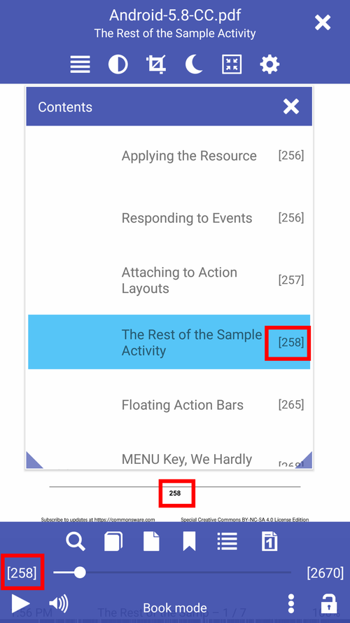

# Paginieren Sie Ihr Dokument erneut, damit es mit den Seitenzahlen des Buches übereinstimmt

> Sehr oft sind die Bücher, die wir lesen, in Teile unterteilt, die eine eigene Paginierung haben, z. B. Einführungen, Autoren- oder Herausgeber-Vorworte, Vorworte, Kommentare usw., und das Buch selbst fängt gut im Dokument an. Wenn Sie Anmerkungen zu dem Buch haben, die sich auf bestimmte Seiten beziehen, werden Sie frustriert sein, sich im Dokument zurechtzufinden. Mit **Librera** können Sie die Seite neu paginieren und die Seitenzahlen Ihren Notizen anpassen.

**Die erneute Paginierung funktioniert für alle Buchformate. Aus offensichtlichen Gründen ist es jedoch hauptsächlich für PDF- und DjVu-Dokumente vorgesehen.**

* Tippen Sie in der Mitte auf, um das Menü zu öffnen
* Drücken Sie lange auf die aktuelle Seitennummer
* Geben Sie im Fenster **Erneut paginieren** eine übereinstimmende Seitennummer ein
* Das Inhaltsverzeichnis des Buches wird automatisch neu angezeigt

> Ihre Lesezeichen für dieses Buch werden ebenfalls erneut paginiert

* Um den Paginierungswiederholungsmodus abzubrechen, rufen Sie das Fenster **Paginieren** auf und tippen Sie auf _RESTORE DEFAULT_.

|1|2|3|
|-|-|-|
||||
