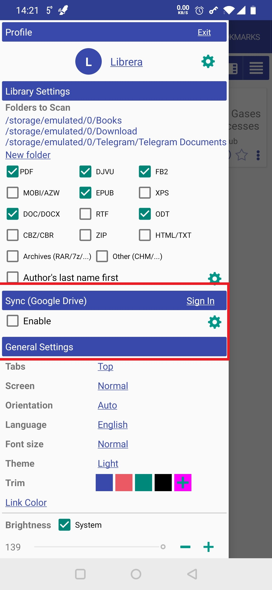

# Synchronisieren des Lese-Setups auf mehreren Geräten

> **Librera** ist mit einem Synchronisierungstool ausgestattet, das nützlich sein sollte, wenn Benutzer mehr als ein Android-Gerät besitzen und (auch sporadisch) zwischen diesen wechseln. Mit diesem Tool können Sie die Profile, den Lesefortschritt, die Lesezeichen und Ihre Leseeinstellungen von **Librera** synchronisieren.

Für die meisten unserer Nutzer haben wir Google Drive als Synchronisierungs-Hub für **Librera** ausgewählt.

* Um die Synchronisierung zu aktivieren, rufen Sie den Bereich _Sync_ auf der Registerkarte _Preferences_ auf und aktivieren Sie das entsprechende Kontrollkästchen
* Sie müssen sich in Ihrem Google Drive-Konto anmelden
 
> **Um eine ordnungsgemäße Synchronisierung sicherzustellen, müssen Ihre anderen Geräte bei demselben Konto angemeldet sein.**

||||
|-|-|-|
||||

## Synchronisierungsoptionen

* Wenn _Manuelle Synchronisierung_ aktiviert ist, müssen Sie mit dem Finger über den Bildschirm streichen, um die Synchronisierung zu starten (in der nativen Pull-to-Refresh-Methode von Android).
* Sie können verhindern, dass sich das Synchronisierungstool in Ihren Datenplan einfügt, indem Sie nur die WiFi-Synchronisierung aktivieren.
* Wenn Sie diese Option aktivieren, können Sie sich mit der Synchronisierungsfortschrittsanimation (Drehrad) beschäftigen
* Um das Synchronisierungsprotokoll anzuzeigen, tippen Sie einfach auf das Einstellungssymbol (Rad) im Bereich _Sync_

||||
|-|-|-|
||||

> Hinweis: Google Drive wurde aus Gründen der Benutzerfreundlichkeit ausgewählt. Google-Konten sind kostenlos und für jedermann verfügbar. Wenn Sie aus irgendeinem Grund eine andere Cloud-Lösung bevorzugen, können Sie diese verwenden:

> **Sie müssen nur den Ordner _Librera_ (der sich in Ihrem internen Speicher befindet) mit Ihrer Cloud synchronisieren. Voilà!**

**PS** Sie können Bücher, die von Online-Ressourcen heruntergeladen wurden, in Ordnern speichern, die über eine Drittanbieter-App synchronisiert wurden, und diese Ordner der Bibliothek von **Librera** hinzufügen.
