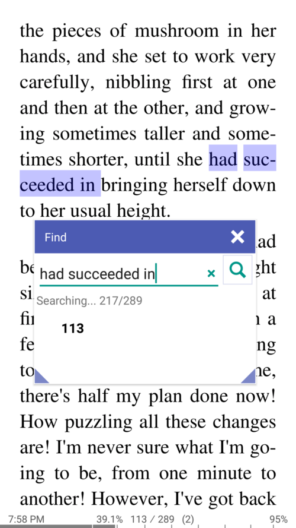

# 7.10

* Un importante aggiornamento basato sulle richieste e sul feedback dei lettori
* Nuova interfaccia di sintesi vocale (TTS)
* Supporto migliorato per EPUB 3.0, riproduzione di file audio
* Query di ricerca multi-parola in tutti i formati, incluso PDF
* Supporto per smartphone con intagli
* La legenda della barra di stato ora ha tre opzioni tra cui scegliere: piena, compatta e orientata ai capitoli
* Altri feedback e richieste sono i benvenuti!

Iscriviti al canale **Librera Reader Telegram** [(https://t.me/LibreraReader)×(https://t.me/LibreraReader), notizie, annunci e molto interessante sulle nuove funzionalità .

# Cosa c'è di nuovo in Librera 7.10

La finestra Impostazioni TTS ha ottenuto un nuovo aspetto e ora funziona meglio in background.
La lettura TTS supporta pause regolabili (interruzioni) in corrispondenza dei segni di punteggiatura.

* controlli TTS in basso
* Facile cambio di velocità
* Miglioramento del comportamento delle notifiche

||||
|-|-|-|
||||

Cerca più parole in qualsiasi formato di libro.
L'opzione &quot;Normalizza dimensione carattere&quot; rende tutti i caratteri della stessa dimensione (altezza) e comprime gli spazi senza interruzioni in spazi singoli.

* Query di ricerca di più parole in un libro
* Disabilita normalizza la dimensione del carattere
* Abilita normalizza dimensione carattere

||||
|-|-|-|
||||

Apri un file audio esterno dalla finestra di dialogo Impostazioni TTS e ascoltalo durante la lettura.
Questa funzione dovrebbe tornare utile per coloro che imparano le lingue straniere o per i musicisti.
Librera Player è anche uno scatto a leggere libri multimediali.
Il formato della legenda della barra di stato può essere modificato da pieno a compatto a orientato ai capitoli

* Lettore audio integrato (per la riproduzione di file audio MP3, MP4, FLAC esterni durante la lettura di un libro)
* Riproduci file multimediali nei libri EPUB3
* Tre formati legenda barra di stato tra cui scegliere

||||
|-|-|-|
||||

Le iniziali iniziali nei capitoli di **libri FB2** possono essere configurate nella finestra di dialogo Configura caratteri.

* Apri la finestra Configura font dopo aver aperto un libro FB2
* Abilita e configura le iniziali iniziali
* Puoi cambiare il loro carattere, colore, dimensione, ecc.

||||
|-|-|-|
||||

* Supporto per telefoni con display dentellati
* Indice per i libri di EPUB 3.0
