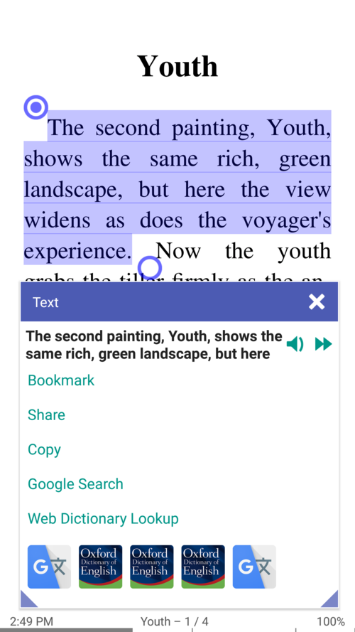

# 7.11

**Новые функции**

* Выбор текста с маркерами начала и конца
* Режим скоростного чтения RSVP (Rapid Serial Visual Presentation) (с поворотом!)
* Подбор и поиск текста в документах DjVu
* Возможность изменить положение строки состояния (сверху или снизу) в режиме книги
* Закладки теперь связаны с процентными значениями прогресса чтения
* Теперь папки можно открывать как книги
* Сортировать книгу Библиотека по языку

**Исправления**

* Создание титульного листа для больших книг AZW и AZW3
* Значок адаптивного приложения в соответствии с последними тенденциями Android 8+
* Правила переноса для большего количества языков
* чтение TTS остановится, если ваше устройство Bluetooth отключится

Подпишитесь на **телеграмму Librera Reader** на канале [https://t.me/LibreraReader](https://t.me/LibreraReader). Будьте первыми, кто узнает о наших последних разработках, никогда не пропускайте самые свежие новости, анонсы и другие интересные материалы, касающиеся новых функций и функций Librera.

**Ручки выбора текста**

* Если пользователь выберет более одного слова, появятся маркеры выбора текста
* Текст может быть выбран либо **построчная**, либо **пословная** мода
* Любую ручку (начало или конец) можно перетаскивать отдельно в режиме реального времени

||||
|-|-|-|
||||

**Чтение/быстрое считывание RSVP (быстрое последовательное визуальное представление)**

Скорость чтения с помощью **Librera** позволяет повысить скорость чтения до 700 слов в минуту (WPM) с помощью метода RSVP.
Пожалуйста, перейдите по ссылке, чтобы найти больше информации по теме [Раздел скорочтения](/manual/Rapid-Serial-Visual-Presentation/ru)

* Режим RSVP можно запустить из меню книги (Скорость чтения)
* Скорость чтения всего одним нажатием
* Отрегулируйте минимальную длину строки: до 30 CPL

||||
|-|-|-|
||||

**Положение строки состояния (вверху или внизу) в режиме книги**

* Строка состояния по умолчанию внизу
* выбрать его позицию из выпадающего списка
* строка состояния сверху

||||
|-|-|-|
||||

**Открыть папку с изображениями в виде книги (связать в книге)**

Чтобы открыть папку как книгу, перейдите к ней на вкладке «Папки» и коснитесь ее имени. Если он содержит хотя бы один файл изображения, вы увидите опцию «Привязать в книгу».

* Открыть папку с изображениями и связать их в книгу
* Папка с изображениями, открытыми как виртуальная книга
* Обрезка пробелов, настройка контрастности и яркости и т. Д.

||||
|-|-|-|
||||

**Сортировка книг по языку**

* Посмотреть все языки доступные в библиотеке
* Сортировка книг по языкам

||||
|-|-|-|
||||

