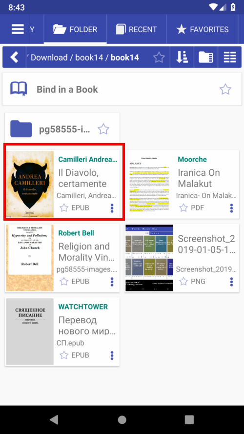
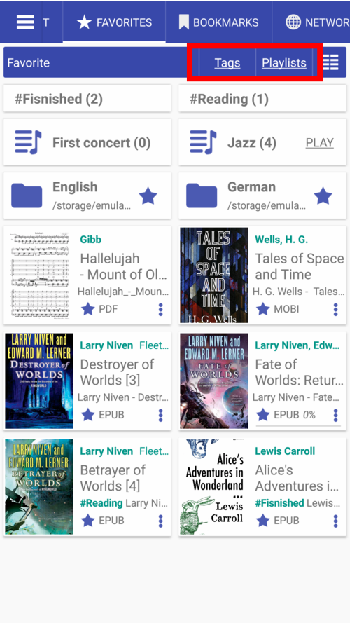
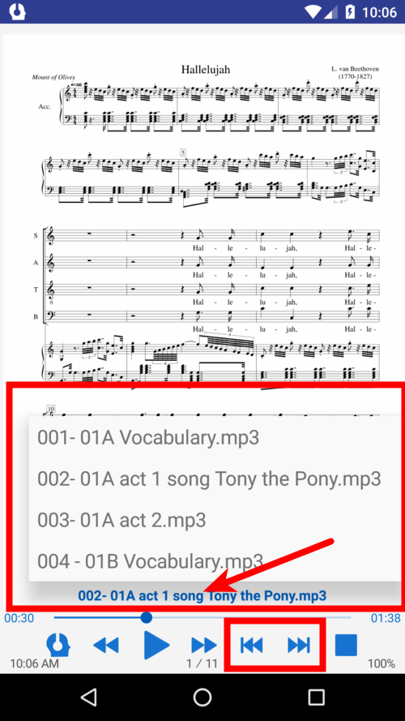

# 7.12

**Neue Funktionen**

* Playlists (Buchgruppierungen)
* Fügen Sie Apps (Wörterbücher) hinzu, um ausgewählten Text im Textfenster zu öffnen
* Spielen Sie MP3-Dateien und -Ordner ab
* Behandeln Sie Buchserien
* Option zum Anzeigen von End-/Fußnoten als In-Text-Notizen
* TTS kann jetzt End-/Fußnoten lesen
* Option zum Fortsetzen des TTS-Lesens am letzten Satzzeichen (Satzmodus)
* Teilen Sie Seiten von anderen Apps (z. B. Browsern) mit Librera Reader
* Unterstützung für traditionelles und vereinfachtes Chinesisch
* Lesezeichen-Multifunktionsleiste für spontane Lesezeichen (z. B. im Musikermodus)
* Dateimanager: Kopieren, Einfügen und Verschieben von Dateien

**Lesezeichen-Multifunktionsleiste**

* Fügen Sie Lesezeichen hinzu, und tippen Sie einmal darauf
* Einfache Navigation in Lesezeichen
* Ein-/Ausblenden des Menübands im Lesemodus

||||
|-|-|-|
||||

**Kopieren, Einfügen und Verschieben von Dateien im Dateimanager**

* Kopieren Sie ein Buch mit einem Buchmenü
* Lesen oder verschieben Sie das Buch in den Ordner
* Klicken Sie auf den Ordnerpfad oder auf das schwarze Feld

||||
|-|-|-|
||||

Tab** Favoriten**

Der Tab **Favoriten** wurde überarbeitet. Auf die Elemente **Tags** und **Playlists** kann jetzt problemlos zugegriffen werden.
Kennzeichnen von Büchern, um sie nach beliebigen allgemeinen Kriterien zu gruppieren, z. B. &quot;Mathematik&quot;, &quot;Thriller&quot;, &quot;Mystery&quot; usw. (Ein Kennzeichen kann auch über das Fenster &quot;Buchinformationen&quot; hinzugefügt werden.)
Playlists sind hauptsächlich für Musiker gedacht: Es ist einfach, ausgewählte Dokumente griffbereit zu halten und die Liste zu bearbeiten.

||||
|-|-|-|
||||

**Playlists**

* Erstellen Sie Wiedergabelisten
* Ziehen Sie an den Ziehpunkten, um die Buchreihenfolge zu ändern
* Streichen Sie nach rechts/links, um ein Buch aus der Liste zu entfernen
* Tippen Sie auf Bearbeiten, um Änderungen an der Liste vorzunehmen.

||||
|-|-|-|
||||

**Nutzer-Apps hinzufügen**

Tippen Sie auf **+**, um eine App hinzuzufügen, mit der der ausgewählte Text geöffnet wird

||||
|-|-|-|
||||

**Umgang mit Buchserien**

Es ist einfach, alle Bücher einer Reihe zu finden:

* Serien können auf der Buchkarte &quot;angeklickt&quot; werden
* Wenden Sie den Serienfilter auf die Buchbibliothek an
* Alle Bücher der Serie werden im Fenster &quot;Buchinformationen&quot; aufgelistet.

||||
|-|-|-|
||||

**MP3-Dateien abspielen**

Hören Sie sich eine MP3-Datei oder eine Dateiauswahl über den internen Player parallel zum Lesen des Buches an.
Könnte nützlich sein für Musiker und für diejenigen, die Fremdsprachen lernen.

||||
|-|-|-|
||||

