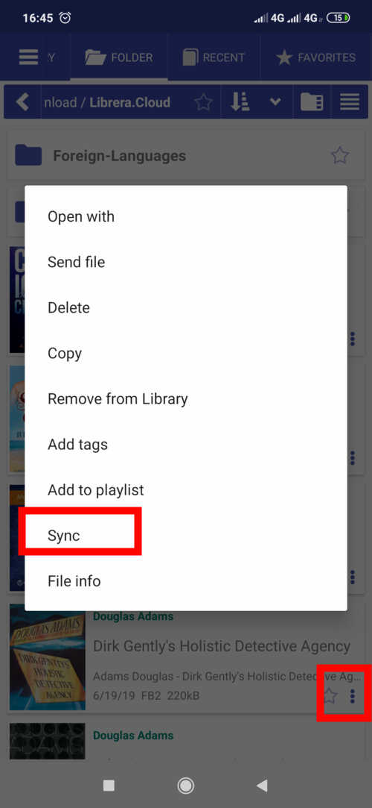

# 8.1

Ao usar este aplicativo, você concorda com os termos da [Política de privacidade](/PrivacyPolicy/pt)

**Novos recursos e melhorias**

* TTS: gravação de livros ou intervalos de páginas inteiros em arquivos MP3 (uma página por arquivo)
* Sincronização entre dispositivos Android via Google Drive (progresso da leitura, favoritos, etc.)
* Vários perfis
* TTS: substituições de caracteres, marcas de estresse manuais, regras RegEx
* Configurações adicionais e navegação no modo Músico
* Funções adicionais alcançáveis através da interface do usuário
* Aprimoramentos diversos na interface do usuário e funcionalidade

# Sincronizando via Google Drive

A sincronização deve ser usada em vários dispositivos Android conectados ao Google Drive. Ao ler um livro, você poderá pegar seu tablet à noite, exatamente onde parou no telefone durante o dia. A sincronização é suportada por **todos os** aplicativos da família Librera. E é GRÁTIS.

Você pode sincronizar os seguintes parâmetros:

* Leitura Progresso para todos os livros que você está lendo no momento (sincronizados ou não). Mantenha os nomes dos arquivos iguais em todos os seus dispositivos e seus livros serão sincronizados automaticamente
* Favoritos
* lista recente
* Favoritos e tags

Exemplos de sincronização

* Ative a sincronização via Google Drive (é necessário ter suas credenciais do Google à mão)
* Para sincronizar um livro, chame seu menu e escolha _Sync_
* Todos os seus livros na guia Favoritos serão sincronizados

||||
|-|-|-|
||||
 
 
# perfis

Usar perfis é como ter várias instâncias do Librera instaladas no seu dispositivo, cada uma com suas configurações, listas de livros, progresso da leitura e marcadores separados. Você tem permissão para criar novos perfis e excluir perfis antigos. Todos os aplicativos da família Librera possuem esse recurso.

Os perfis são armazenados na memória interna do dispositivo em /sdcard/Librera/profile.[NAME]. Suas configurações, favoritos e progresso da leitura são armazenados em arquivos JSON, que podem ser visualizados com qualquer visualizador de JSON (evite modificá-los!).

Se pressionar **** no nome do perfil, será exibida uma janela de alerta para que você restaure as configurações padrão (iniciais) (seus favoritos e os progressos da leitura permanecerão intactos).

||||
|-|-|-|
||||

# substituições e dicionários TTS

* Toque em &quot;Substituições&quot; em **Configurações do TTS** e adicione uma nova regra de leitura.
* Substitua um conjunto de caracteres (entre colchetes) com um único caractere para ser lido ou ignorado
* Substitua uma palavra por outra, por exemplo, &quot;lib&quot; -&gt; &quot;Librera&quot;
* Adicione marcas de estresse manualmente (se o seu mecanismo TTS suportar): &quot;Librera&quot; -&gt; &quot;Libréra&quot;
* Toque em &quot;Mostrar&quot; para ver os resultados das substituições
* Adicione um dicionário externo: o Librera suporta arquivos de substituição do @Voice Aloud e .txt RegEx

||||
|-|-|-|
||||

# Configurações adicionais no modo de músico

* Mostrar \ ocultar zonas de toque (delineadas com linhas pontilhadas)
* Indique a última página com listras vermelhas (estreitas e largas)
* Destaque separadores de páginas para melhorar a legibilidade
* Navegue da primeira para a última página tocando na zona Página anterior
* Navegue da última para a primeira página tocando na zona Próxima página

||||
|-|-|-|
||||

# Funções adicionais e melhorias na interface do usuário

* Compartilhe \ copie páginas como imagens \ texto (pressione e segure em uma miniatura da página na janela _Ir para a página_)
* Suporte para telas entalhadas
* Novos parâmetros de classificação: classifique por **Editor** e **Data da publicação**

||||
|-|-|-|
||||

# Diversos

* Suporte para os formatos MathML e SVG. Habilite-o nas opções avançadas (pode diminuir o carregamento inicial do livro)
* Opção para ignorar os metadados nas visualizações Biblioteca e Pasta (somente nomes de arquivos serão exibidos)
* Marcador móvel, com um indicador flutuante (marca automaticamente sua posição atual de leitura e permite que você volte para ela, via flutuador no canto inferior direito, após visitas temporárias a outras partes e seções do livro). Para iniciar (adicionar) um marcador móvel, marque a caixa **Flutuante**
* Permitir que impressões digitais sejam usadas em vez de senha (Android 9+)
* Permita que o tempo limite de suspensão do sistema seja usado para desligar a tela

